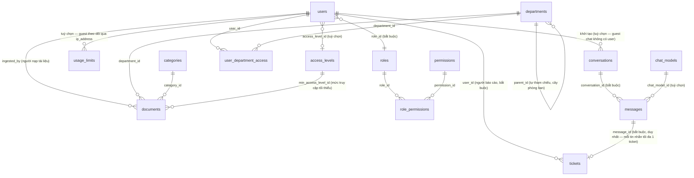

# 0001: Sơ đồ Thực thể - Quan hệ (backend-java)

- **Ngày**: 2026-08-22
- **Phạm vi**: Toàn bộ thực thể JPA hiện có trong `src/main/java/com/unisage/backend/entity/`, ánh xạ sang các bảng PostgreSQL tương ứng.
- **Nguồn**: đọc trực tiếp mã nguồn thực thể (không phải suy đoán từ migration) — mỗi thực thể liệt kê bên dưới đối chiếu 1-1 với file `.java` cùng tên.

## Mục đích tài liệu

Tài liệu này mô tả **cấu trúc quan hệ** giữa các thực thể nghiệp vụ: bảng nào tham chiếu tới bảng nào, quan hệ bắt buộc hay tuỳ chọn, một-nhiều hay nhiều-nhiều. Chi tiết từng cột (kiểu dữ liệu, ràng buộc, chỉ mục) nằm ở tài liệu liền kề [0002-db.md](./0002-db.md).

## Sơ đồ quan hệ tổng thể

> Ghi chú ký hiệu mermaid: `||--o{` = một-nhiều, phía "một" bắt buộc tồn tại; `}o--||` = phía nhiều trỏ về một bản ghi cha bắt buộc (FK NOT NULL); `}o--o|` = phía nhiều trỏ về một bản ghi cha tuỳ chọn (FK nullable).

## Diễn giải theo từng cụm nghiệp vụ

### 1. Phân quyền (Vai trò — Quyền hạn — Cấp độ truy cập)

- `users.role_id → roles.id`: **bắt buộc**. Mỗi người dùng có đúng một vai trò; `roles.is_system_role` đánh dấu vai trò hệ thống không được xoá qua UI.
- `roles ↔ permissions` là quan hệ **nhiều-nhiều**, hiện thực hoá qua bảng nối `role_permissions` — không có cột `id` riêng, khoá chính là cặp `(role_id, permission_id)`.
- `users.access_level_id → access_levels.id`: **tuỳ chọn**. `access_levels.level` là số nguyên duy nhất (unique) dùng để so sánh thứ bậc truy cập (vd tài liệu yêu cầu `min_access_level_id` — người dùng phải có `access_levels.level` ≥ mức đó mới được xem).
- `permissions.path` + `permissions.method` (enum `PermissionMethod`: GET/POST/PUT/PATCH/DELETE/ALL) mô tả một endpoint cụ thể được bảo vệ; `permissions.resource_type` (enum `ResourceType`) phân loại tài nguyên bằng nhãn tiếng Việt (vd "Tài liệu", "Phòng ban").

### 2. Phòng ban và phân quyền truy cập theo phòng ban

- `departments.parent_id → departments.id`: **tự tham chiếu, tuỳ chọn** — tạo cây phân cấp phòng ban (phòng ban gốc có `parent_id = NULL`).
- `users ↔ departments` là quan hệ **nhiều-nhiều với thuộc tính phụ**, hiện thực hoá qua bảng nối `user_department_access` — khoá chính là cặp `(user_id, department_id)`, kèm cột `access_level` (số nguyên rời rạc, **không phải khoá ngoại** tới `access_levels`) biểu thị mức truy cập của người dùng đó riêng cho phòng ban đó.

### 3. Tài liệu (Document) và phân loại

- `documents.department_id → departments.id`, `documents.category_id → categories.id`, `documents.min_access_level_id → access_levels.id`, `documents.ingested_by → users.id`: bốn khoá ngoại độc lập, cùng thuộc về `documents` (bảng con sở hữu cả 4 FK).
- `documents.status` là enum `DocStatus` (PENDING/PROCESSING/COMPLETED/FAILED/OUTDATED) — theo dõi tiến trình nạp liệu (ingest pipeline), không phải trạng thái xoá (`deleted_at` đảm nhiệm việc đó — xoá mềm).
- `documents.file_type` là **chuỗi tự do do client cung cấp** (metadata hiển thị) — **không** liên quan tới enum `AllowedFileType` dùng để kiểm tra whitelist khi tải file lên MinIO (xem ADR `docs/adr/0001-document-file-upload-validation-policy.md`); `AllowedFileType` không được lưu vào cơ sở dữ liệu.

### 4. Hội thoại (Conversation) và Tin nhắn (Message)

- `conversations.user_id → users.id`: **tuỳ chọn** — hội thoại của khách vãng lai (guest) không gắn với người dùng đã đăng nhập; danh tính khách được lưu tạm qua `conversations.ip_address`.
- `messages.conversation_id → conversations.id`: **bắt buộc** — mọi tin nhắn phải thuộc về một hội thoại.
- `messages.chat_model_id → chat_models.id`: **tuỳ chọn** — chỉ tin nhắn do trợ lý (role `ASSISTANT`) sinh ra mới gắn với một mô hình chat cụ thể đã dùng để trả lời.
- `messages.role` là enum `MsgRole` (USER/ASSISTANT/SYSTEM); `messages.status` là enum `MsgStatus` (PENDING/STREAMING/COMPLETED/ERROR) — theo dõi vòng đời sinh câu trả lời (đặc biệt quan trọng khi streaming).

### 5. Yêu cầu hỗ trợ (Ticket)

- `tickets.user_id → users.id`: **bắt buộc** — người dùng đã đăng nhập báo cáo câu trả lời; danh tính luôn lấy từ JWT, không nhận từ client.
- `tickets.message_id → messages.id`: **bắt buộc và duy nhất** (`UNIQUE(message_id)`) — mỗi tin nhắn tối đa một ticket; chỉ báo cáo được tin nhắn `ASSISTANT` trong hội thoại của chính người báo cáo (kiểm tra ở tầng service).
- Chưa có người được giao xử lý (`assignedTo`), phòng ban, hay xóa mềm (`deletedAt`): nhân sự có quyền `TICKET_*` chỉ đổi `status` và ghi `resolution`. Có thể thêm bằng migration riêng khi cần.
- `tickets.type` là enum `TicketType`, `tickets.status` là enum `TicketStatus` — xem [0002-db.md](./0002-db.md).

### 6. Giới hạn sử dụng (Usage Limit)

- `usage_limits.user_id → users.id`: **tuỳ chọn** — cùng logic với `conversations.user_id`, khách vãng lai theo dõi giới hạn qua `ip_address` thay vì `user_id`.
- Ràng buộc duy nhất kép (một cho danh tính user, một cho danh tính IP) đảm bảo không có hai bản ghi trùng `(định danh, limit_type, scope, scope_date)` — chi tiết ở [0002-db.md](./0002-db.md).

## Các thực thể không tham gia quan hệ khoá ngoại

- `chat_models`: là bảng cấu hình mô hình LLM (nhà cung cấp, tên mô hình, API key mã hoá, ưu tiên, đếm lỗi) — chỉ được **tham chiếu tới** (từ `messages`), không tự tham chiếu bảng khác.
- `access_levels`, `categories`: bảng danh mục thuần, chỉ được tham chiếu tới.

## Khoá chính và chiến lược định danh

- Tất cả thực thể kế thừa `BaseEntity` dùng khoá chính `UUID` sinh tự động (`@GeneratedValue(generator = "UUID")`), kèm 5 cột kiểm toán chung: `created_at`, `created_by`, `updated_at`, `updated_by`, `is_active`.
- Ngoại lệ: `role_permissions` và `user_department_access` là **bảng nối thuần** (pure join table) — không kế thừa `BaseEntity`, không có cột kiểm toán, khoá chính là **khoá tổ hợp** (`@IdClass`) gồm hai khoá ngoại.

## Tham chiếu

- Chi tiết cột/kiểu dữ liệu/ràng buộc/chỉ mục từng bảng: [0002-db.md](./0002-db.md).
- Quyết định liên quan tới việc tải file lên MinIO (không phải một bảng trong cơ sở dữ liệu, nhưng liên quan tới `documents`): `docs/adr/0001-document-file-upload-validation-policy.md`.
